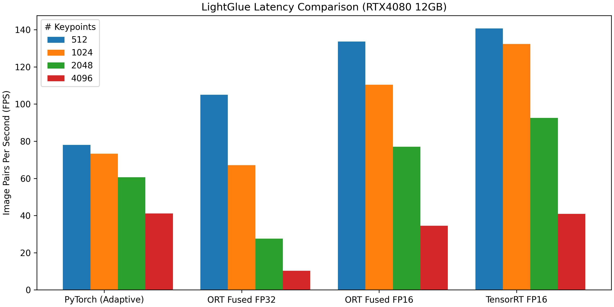

<div align="right"> <a href="https://github.com/fabio-sim/LightGlue-ONNX">English</a> | 简体中文</div>

[](https://onnx.ai/)
[](https://developer.nvidia.com/tensorrt)
[](https://github.com/fabio-sim/LightGlue-ONNX/stargazers)
[](https://github.com/fabio-sim/LightGlue-ONNX/releases)

# LightGlue ONNX

支持 Open Neural Network Exchange (ONNX)的[LightGlue: Local Feature Matching at Light Speed](https://github.com/cvg/LightGlue)实施。ONNX 格式支持不同平台之间的互操作性，并支持多个执行提供程序，同时消除了 Python 特定的依赖项，比如 PyTorch。支持 TensorRT 和 OpenVINO。

> ✨ **_新增功能 - 2023 年 10 月 4 日:_** Fused LightGlue ONNX 模型，通过`onnxruntime>=1.16.0`支持 FlashAttention-2。

<p align="center"><a href="https://arxiv.org/abs/2306.13643"></a>

<details>
<summary>更新</summary>

-   **2023 年 11 月 02 日**: 使用 TopK 换 ArgMax 比较快。
-   **2023 年 10 月 27 日**: Kornia 支持 LightGlue-ONNX。
-   **2023 年 10 月 4 日**: Multihead-attention fusion。
-   **2023 年 7 月 19 日**: 支持 TensorRT。
-   **2023 年 7 月 13 日**: 支持 FlashAttention。
-   **2023 年 7 月 11 日**: 支持混合精度。
-   **2023 年 7 月 4 日**: 加了运行时间比较。
-   **2023 年 7 月 1 日**: 支持特征提取`max_num_keypoints`。
-   **2023 年 6 月 30 日**: 支持 DISK 特征提取。
-   **2023 年 6 月 28 日**: 加了端到端 SuperPoint+LightGlue 转换。
</details>

## 🔥 ONNX 格式转换

在转换 ONNX 模型之前，请安装原始 LightGlue 的[export requirements](/requirements-export.txt)。

将 DISK 或 SuperPoint 和 LightGlue 模型转换为 ONNX 格式，请运行[`export.py`](/export.py)。提供了两种类型的 ONNX 转换：独立模型和组合模型。

<details>
<summary>转换例子</summary>
<pre>
python export.py \
  --img_size 512 \
  --extractor_type superpoint \
  --extractor_path weights/superpoint.onnx \
  --lightglue_path weights/superpoint_lightglue.onnx \
  --dynamic
</pre>
</details>

### 🌠 ONNX 模型优化 🎆

尽管 ONNXRuntime 自动提供开箱即用的[一些优化](https://onnxruntime.ai/docs/performance/model-optimizations/graph-optimizations.html)，但某些专门的算子融合（multi-head attention fusion）必须手动应用。请运行[`optimize.py`](/optimize.py)。在具有足够计算能力的设备上，ONNXRuntime（最低版本`1.16.0`）会将算子分派给 FlashAttention-2，从而减少大量关键点的推理时间。

<details>
<summary>优化例子</summary>
<pre>
python optimize.py --input weights/superpoint_lightglue.onnx
</pre>
</details>

如果您想立即尝试 ONNX 运行，可以下载已转换的[ONNX 模型](https://github.com/fabio-sim/LightGlue-ONNX/releases)。

## ⚡ ONNX 推理

有了 ONNX 模型，就可以使用 ONNX Runtime 进行推理(请先安装[requirements-onnx.txt](/requirements-onnx.txt))。

```python
from app.LightGlueOnnx.onnx_runner import LightGlueRunner, load_image, rgb_to_grayscale

image0, scales0 = load_image("assets/sacre_coeur1.jpg", resize=512)
image1, scales1 = load_image("assets/sacre_coeur2.jpg", resize=512)
image0 = rgb_to_grayscale(image0)  # only needed for SuperPoint
image1 = rgb_to_grayscale(image1)  # only needed for SuperPoint

# Create ONNXRuntime runner
runner = LightGlueRunner(
    extractor_path="weights/superpoint.onnx",
    lightglue_path="weights/superpoint_lightglue.onnx",
    providers=["CUDAExecutionProvider", "CPUExecutionProvider"],
    # TensorrtExecutionProvider, OpenVINOExecutionProvider
)

# Run inference
m_kpts0, m_kpts1 = runner.run(image0, image1, scales0, scales1)
```

请注意，被输出的特征点已经换回原来的图像大小了。

您也可以运行[`infer.py`](/infer.py)。

<details>
<summary>推理例子</summary>
<pre>
python infer.py \
  --img_paths assets/DSC_0410.JPG assets/DSC_0411.JPG \
  --img_size 512 \
  --lightglue_path weights/superpoint_lightglue.onnx \
  --extractor_type superpoint \
  --extractor_path weights/superpoint.onnx \
  --viz
</pre>
</details>

## 🚀 TensorRT

TensorRT 推理使用 ONNXRuntime 的 TensorRT Execution Provider。请先安装[TensorRT](https://docs.nvidia.com/deeplearning/tensorrt/install-guide/index.html)。

<details>
<summary>TensorRT例子</summary>
<pre>
CUDA_MODULE_LOADING=LAZY && python infer.py \
  --img_paths assets/DSC_0410.JPG assets/DSC_0411.JPG \
  --lightglue_path weights/superpoint_lightglue_fused_fp16.onnx \
  --extractor_type superpoint \
  --extractor_path weights/superpoint.onnx \
  --trt \
  --viz
</pre>
</details>

第一次运行时，TensorRT 需要一点时间始化`.engine`和`.profile`。建议使用 TensorRT 时传递恒定数量的关键点。

## 推理时间比较

一般来说，自适应 PyTorch 模型提供了更一致的全面延迟，而融合的 ORT 模型由于`NonZero`运算符的瓶颈，在关键点数量较高时变得更慢。 另一方面，TensorRT Execution Provider 可以达到非常低的延迟，但它也是不一致且不可预测的。请参阅[EVALUATION.md](/evaluation/EVALUATION.md)。

<p align="center"><a href="https://github.com/fabio-sim/LightGlue-ONNX/blob/main/evaluation/EVALUATION.md"></a>

## 引用

如果使用这项目的代码或想法，请引用原本作者的论文：[LightGlue](https://arxiv.org/abs/2306.13643)，[SuperPoint](https://arxiv.org/abs/1712.07629)，[DISK](https://arxiv.org/abs/2006.13566)。最后，如果本项目的 ONNX 版以任何方式帮助了您，也请给个 star。

```txt
@inproceedings{lindenberger23lightglue,
  author    = {Philipp Lindenberger and
               Paul-Edouard Sarlin and
               Marc Pollefeys},
  title     = {{LightGlue}: Local Feature Matching at Light Speed},
  booktitle = {ArXiv PrePrint},
  year      = {2023}
}
```

```txt
@article{DBLP:journals/corr/abs-1712-07629,
  author       = {Daniel DeTone and
                  Tomasz Malisiewicz and
                  Andrew Rabinovich},
  title        = {SuperPoint: Self-Supervised Interest Point Detection and Description},
  journal      = {CoRR},
  volume       = {abs/1712.07629},
  year         = {2017},
  url          = {http://arxiv.org/abs/1712.07629},
  eprinttype    = {arXiv},
  eprint       = {1712.07629},
  timestamp    = {Mon, 13 Aug 2018 16:47:29 +0200},
  biburl       = {https://dblp.org/rec/journals/corr/abs-1712-07629.bib},
  bibsource    = {dblp computer science bibliography, https://dblp.org}
}
```

```txt
@article{DBLP:journals/corr/abs-2006-13566,
  author       = {Michal J. Tyszkiewicz and
                  Pascal Fua and
                  Eduard Trulls},
  title        = {{DISK:} Learning local features with policy gradient},
  journal      = {CoRR},
  volume       = {abs/2006.13566},
  year         = {2020},
  url          = {https://arxiv.org/abs/2006.13566},
  eprinttype    = {arXiv},
  eprint       = {2006.13566},
  timestamp    = {Wed, 01 Jul 2020 15:21:23 +0200},
  biburl       = {https://dblp.org/rec/journals/corr/abs-2006-13566.bib},
  bibsource    = {dblp computer science bibliography, https://dblp.org}
}
```
